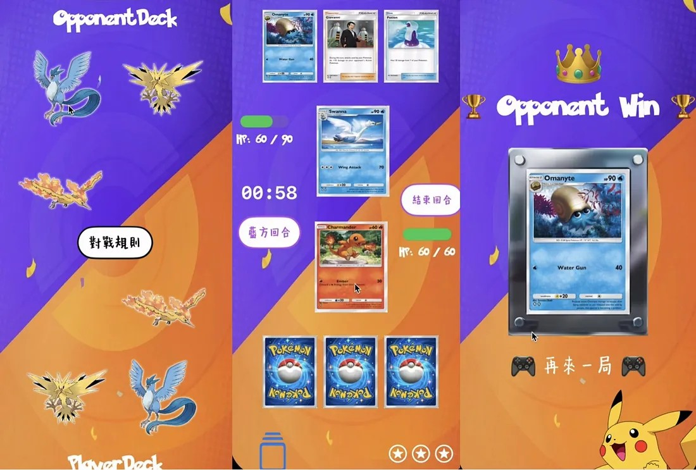

# Pokemon Playground - SwiftUI 綜合應用 App ⚡️

這是一個基於 SwiftUI 開發的 iOS 綜合應用程式專案。本專案將 **電子書圖鑑**、**趣味問答 (Quiz)** 以及 **寶可夢卡牌對戰 (TCG)** 結合在一個 App 中。

專案展示了 SwiftUI 的多種進階技巧，包含使用 iOS 17+ 的 `Observation` 框架進行遊戲狀態管理、複雜的動畫轉場、AVFoundation 音效控制以及模組化的 UI 設計。

---

## 📚 專案介紹與開發歷程 (Medium)

本專案的開發過程、技術難點與心得詳細記錄於以下三篇 Medium 文章：

1.  **電子書與動畫效果**：介紹如何使用 TabView、List 與動畫製作精美的資訊頁面。
    * [📖 閱讀文章：使用 SwiftUI 製作結合酷炫動畫效果的電子書 App](https://medium.com/%E6%B5%B7%E5%A4%A7-ios-app-%E7%A8%8B%E5%BC%8F%E8%A8%AD%E8%A8%88/ios%E6%87%89%E7%94%A8%E7%A8%8B%E5%BC%8F%E9%96%8B%E7%99%BC%E5%85%A5%E9%96%80-02%E4%BD%BF%E7%94%A8-swiftui-%E8%A3%BD%E4%BD%9C%E7%B5%90%E5%90%88%E9%85%B7%E7%82%AB%E5%8B%95%E7%95%AB%E6%95%88%E6%9E%9C%E7%9A%84%E9%9B%BB%E5%AD%90%E6%9B%B8-app-d6e200a65d7f)

2.  **是非題小遊戲**：實作問答邏輯、計分系統與互動回饋。
    * [❓ 閱讀文章：加分作業 - 是非題 App](https://medium.com/%E6%B5%B7%E5%A4%A7-ios-app-%E7%A8%8B%E5%BC%8F%E8%A8%AD%E8%A8%88/ios%E6%87%89%E7%94%A8%E7%A8%8B%E5%BC%8F%E9%96%8B%E7%99%BC%E5%85%A5%E9%96%80-%E5%8A%A0%E5%88%86%E4%BD%9C%E6%A5%AD-%E6%98%AF%E9%9D%9E%E9%A1%8C-app-1d463850a955)

3.  **對戰遊戲 (Game Logic)**：使用 Observation 進行狀態管理，實作完整的回合制戰鬥系統。
    * [⚔️ 閱讀文章：開發有趣的 SwiftUI 小遊戲 - 使用 Observation 管理遊戲狀態](https://medium.com/%E6%B5%B7%E5%A4%A7-ios-app-%E7%A8%8B%E5%BC%8F%E8%A8%AD%E8%A8%88/ios%E6%87%89%E7%94%A8%E7%A8%8B%E5%BC%8F%E9%96%8B%E7%99%BC%E5%85%A5%E9%96%80-03-%E9%96%8B%E7%99%BC%E6%9C%89%E8%B6%A3%E7%9A%84swiftui%E5%B0%8F%E9%81%8A%E6%88%B2%E4%B8%80-%E4%BD%BF%E7%94%A8-observation-%E7%AE%A1%E7%90%86%E9%81%8A%E6%88%B2%E7%8B%80%E6%85%8B-5d64c4136767)

---

## 📱 功能展示與技術實作 (Features & Tech Specs)

### 1. 電子書圖鑑 (Pokedex E-Book)
展示寶可夢的詳細資訊、屬性介紹。
* **UI 架構**：使用 `NavigationView` 配合 `List` 與 `ScrollView` 實現層級式導覽。
* **資料模型**：透過 `Pokemon` Struct 定義資料結構，並依照屬性 (Type) 進行分類顯示。
* **自定義元件**：實作 `InfoRow` 來統一列表項目的視覺風格。

  

---

### 2. 是非題挑戰 (Quiz Game)
考驗玩家對寶可夢規則與屬性的了解。

#### 🛠 技術實作重點 (`questionView.swift`):
* **資料結構化**：使用 Enum `QuestionGroup` 管理題庫分類（如：初級規則、屬性相剋），並透過 Struct `Question` 定義題目類型（是非題/選擇題）。
* **UI 互動設計**：
    * **Instagram 限動風格選單**：使用 `ScrollView(.horizontal)` 製作圓形圖標的題庫選擇器。
    * **動態回饋**：利用 `onChange` 監聽答題狀態 (`isSuccess`, `isFailed`)，觸發 `scaleEffect` 縮放動畫與位移動畫來顯示成功或失敗的圖片。
* **隨機出題邏輯**：使用 `shuffled()` 與 `prefix()` 隨機從題庫中抽取題目，並確保題目不重複。

  

---

### 3. 卡牌對戰遊戲 (Card Battle Game)
核心功能，實作了完整的寶可夢卡牌對戰邏輯。

#### 🛠 技術實作重點 (`Game.swift`):
* **狀態管理 (Observation Framework)**：
    * 使用 iOS 17 的 `@Observable` 標記 `PokemonCard` 類別，實現當 HP 或能量變動時，UI 會自動刷新。
    * 使用 `ObservableObject` 管理 `DeckSelection` (牌組選擇) 狀態。
* **物件導向設計 (Protocol Oriented)**：
    * 定義 `protocol Card`，讓 `PokemonCard` (寶可夢卡) 與 `ItemCard` (道具卡) 遵循同一協議，方便在手牌陣列 `[any Card]` 中統一管理。
* **遊戲核心邏輯 (`PokemonTCGView`)**：
    * **回合制系統**：透過 `isPlayerTurn` 布林值切換玩家與電腦回合，並結合 `Timer` 限制回合時間。
    * **戰鬥判定 (`performAttack`)**：實作屬性相剋 (Type Weakness) 邏輯（如：水剋火，傷害加倍）以及 HP 扣減邏輯。
    * **道具效果**：使用 Enum `ItemEffect` 實作策略功能（回復 HP、增加傷害、查看對手手牌）。
* **動畫與特效**：
    * **3D 翻硬幣**：在 `CoinFlipSheetView` 中使用 `.rotation3DEffect` 實作硬幣拋擲的物理動畫效果。
    * **攻擊回饋**：使用 `.animation(.interpolatingSpring)` 製作卡片撞擊的視覺效果。
    * **動態血條**：`HPGaugeView` 使用 `Capsule` 與幾何計算，動態顯示剩餘血量。

> **👇 點擊下方圖片觀看 YouTube 展示影片**

---

## 📂 專案結構

* `ContentView.swift`: App 入口點。
* `Game.swift`: 對戰遊戲的所有視圖與邏輯核心。
* `questionView.swift`: 問答遊戲視圖與題庫邏輯。
* `Pokemon.swift`: 寶可夢資料模型定義。
* `book.swift` / `Detail1.swift`: 電子書相關視圖。
* `Assets.xcassets`: 包含所有卡牌圖片、背景圖與屬性圖示。

## 🎨 字體與素材
專案中使用了風格化的自定義字體以增強遊戲沉浸感：
* **Cubic_11**: 用於按鈕與標題。
* **Pokemon Solid**: 用於特定強調文字。
* **HanyiSentyCrayon**: 用於手寫風格的說明文字。

---

## 👤 作者 (Author)

* **Name**: 楊浤立
* **Student ID**: 01157025
* **Created Date**: 2024/11/28
